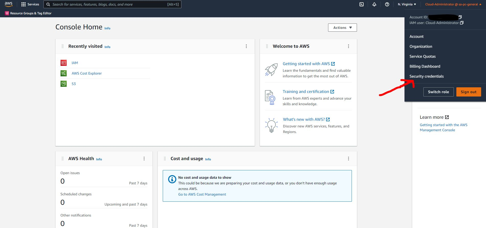

# Enabling MFA for your account

1. On AWS console, click on your name on the top right hand corner and then click on "Security Credentials"



2. Click on "Assign MFA Device"
   
   

3. Select ```Virtual MFA``` however, if you were doing this in an actual production environment. It is recommended that you have a hardware MFA device
   
   

4. Click to review the QR code and select the virtual MFA of your choice such as Microsoft Authenticator, Google Authenticator or Fortitoken. You will need to make sure that you enter the first code you see on your MFA app in the "MFA code 1" field and wait until your MFA app generates you a second code in which you will enter into the "MFA code 2" field. 


5. Once you have set up your MFA you should see the screen below

