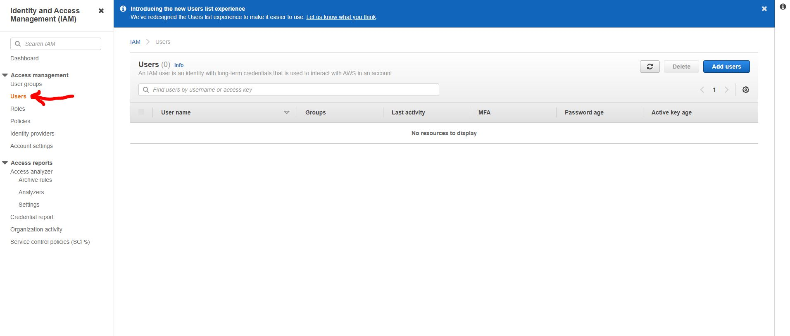
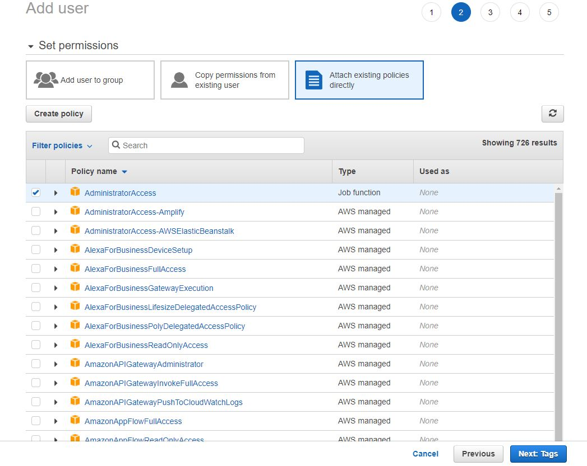
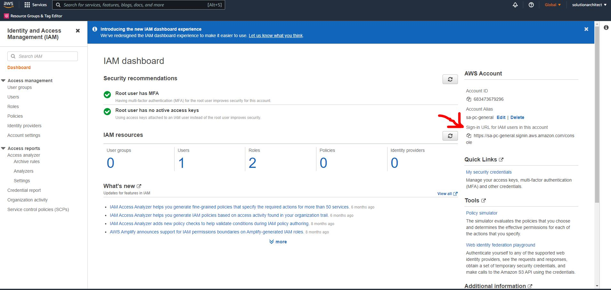
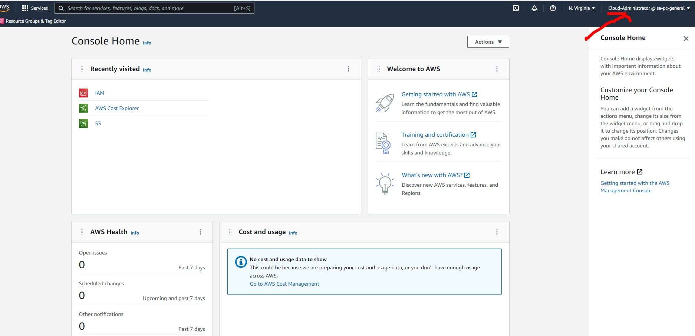

# Creating an IAM identity with admin permissions
*Last updated: 18-02-2022*

1. Go to IAM on AWS
2. Within IAM click on "Users" on the left hand side of your screen
   
   

3. Click on "Add user"
4. Name user whatever you want but include the name "admin" within the user name then click "Next"
5. If you have created an your own admin policy then attach that to your admin user otherwise attach the policy ```AdministratorAccess``` to your admin user.



6. Add any tags that you may want to add then click "Next: Review"
7. Click on "Create User"
8. Save the ```Sign-in URl for IAM users in this account``` somewhere as this is how your IAM users will log onto your AWS account. 
   
   
9. Copy the url into your address bar and go to it. The first field will be populated with your account [alias](create-account-alias.md) that you had created.
10. Enter in your IAM user name and password. In our case our IAM user name which we created earlier was "Cloud-Administrator".
11. Once logged in you will now see that you are logged into your cloud admin account on the top right
    
    
12. [Configure MFA](../account/enable-account-mfa.md) for your cloud admin account. 